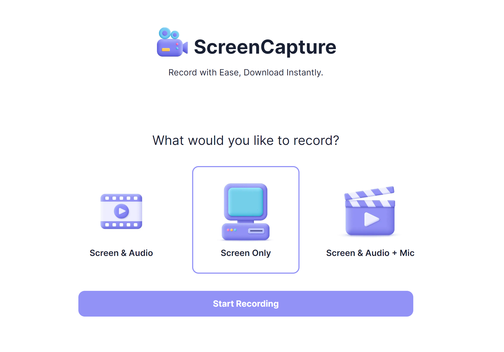

# 🎬 ScreenCapture



## 📝 Description

ScreenCapture is a versatile media recording application that allows users to capture screen activity, audio input, and more. Whether you're recording presentations, tutorials, or gameplay, ScreenCapture provides intuitive features for seamless recording

## 🔮 Features

-   🖥️ Screen recording with options:
    -   🖥️ Screen only
    -   🔊 Screen with system audio
    -   🎙️ Screen with system audio + microphone
-   📺 Live preview of recordings
-   ⏯️ Easy-to-use interface for recording controls, including pause and resume
-   🛠️ Simple installation process
-   🌐 Cross-Browser Compatibility

## 🚀 Live Preview

You can view the live preview of the project [here](https://media-master.vercel.app).

## 💻 Technologies Used

-   Next.js
-   Tailwind CSS
-   MediaStream API

## ⚙️ Installation

1. Clone the repository:
    ```bash
    git clone https://github.com/sahilatahar/ScreenCapture.git
    ```
2. Navigate to the project directory:
    ```bash
    cd ScreenCapture
    ```
3. Install dependencies:
    ```bash
    npm install
    ```
4. Start the application:
    ```
    npm run dev
    ```
5. Open the application in your browser:
    ```
    http://localhost:3000
    ```

